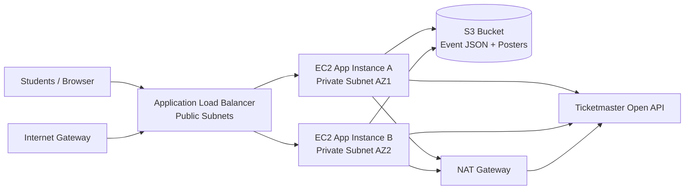

# UniEvent: Scalable University Event Management System on AWS

UniEvent is a cloud-hosted web application for university event discovery and poster uploads.
This solution is designed for high availability, security, and scalability using:
- IAM
- VPC
- EC2 (Auto Scaling across private subnets)
- S3
- Elastic Load Balancer (Application Load Balancer)

It integrates with the Ticketmaster Open API and displays fetched events as official "University Events".

## 1. Solution Overview

### Core behavior implemented
1. The web app runs on multiple EC2 instances in private subnets.
2. The app periodically fetches events from Ticketmaster API.
3. Event data is normalized and stored in shared S3 (`events/latest.json`).
4. Event posters uploaded by users are stored privately in S3 (`posters/`).
5. Users view fetched events from the web UI and JSON API.
6. If one EC2 instance fails, ALB + ASG keep service available.

### Architecture diagram (logical)


## 2. Repository Structure

```text
UniEvent/
  app/
    app.py
    requirements.txt
    wsgi.py
    templates/index.html
  infra/terraform/
    main.tf
    variables.tf
    outputs.tf
    versions.tf
    userdata.sh.tpl
    terraform.tfvars.example
  README.md
  .gitignore
```

## 3. Prerequisites

Install locally:
1. Git
2. AWS CLI v2
3. Terraform >= 1.5

Configure AWS credentials:
```powershell
aws configure
```

## 4. Step-by-Step: Upload Project to GitHub

If you have not created a GitHub repo yet, create one named `UniEvent` (public or private).
Then run from project root:

```powershell
git init
git add .
git commit -m "Initial UniEvent scalable AWS deployment"
git branch -M main
git remote add origin https://github.com/<your-username>/UniEvent.git
git push -u origin main
```

Note: Do not commit secrets directly. Keep API keys in `terraform.tfvars` locally.

## 5. Step-by-Step: Deploy on AWS

### 5.1 Move to Terraform directory
```powershell
cd infra\terraform
```

### 5.2 Create `terraform.tfvars`
Create `infra/terraform/terraform.tfvars`:

```hcl
project_name         = "unievent"
aws_region           = "us-east-1"
app_repo_url         = "https://github.com/<your-username>/UniEvent.git"
instance_type        = "t3.micro"
ticketmaster_api_key = "DEMEcjR0QCiK9oQ9EK91IWglsCcCpLzE"
```

### 5.3 Initialize Terraform
```powershell
terraform init
```

### 5.4 Review plan
```powershell
terraform plan -out tfplan
```

### 5.5 Apply infrastructure
```powershell
terraform apply tfplan
```

This creates:
1. VPC with 2 public + 2 private subnets across AZs
2. Internet Gateway + NAT Gateway
3. Private S3 bucket with encryption and public access blocked
4. IAM role/profile for EC2 to access only required S3 resources
5. ALB + Target Group + Listener
6. Launch Template + Auto Scaling Group (min 2 instances)

### 5.6 Get ALB URL
```powershell
terraform output alb_dns_name
```
Open `http://<alb_dns_name>` in browser.

## 6. Functional Validation

### 6.1 Health check
```powershell
curl http://<alb_dns_name>/health
```
Expected: JSON with `status: ok`.

### 6.2 View events
```powershell
curl http://<alb_dns_name>/api/events
```
Expected: Event list fetched from Ticketmaster and served as university events.

### 6.3 Upload poster image
```powershell
curl -X POST -F "file=@poster.jpg" http://<alb_dns_name>/upload
```
Expected: JSON containing `s3_key` and temporary `preview_url`.

### 6.4 Verify failover
1. In AWS Console, terminate one instance in the Auto Scaling Group.
2. ASG launches replacement instance automatically.
3. Refresh ALB URL; service remains available.

## 7. Security and Best Practices Justification

1. EC2 instances are private (not directly internet exposed).
2. Only ALB is public-facing.
3. S3 bucket is private, encrypted, and blocks all public access.
4. IAM policy uses least privilege for S3 actions.
5. ALB health checks remove unhealthy instances from traffic.
6. Multi-AZ ASG improves fault tolerance.
7. API key is injected at deploy-time via Terraform variable (not hardcoded in app source).

## 8. Cost Awareness

Main cost contributors:
1. NAT Gateway
2. ALB
3. EC2 instances
4. S3 storage

For academic demos, destroy resources immediately after validation.

## 9. Cleanup

```powershell
cd infra\terraform
terraform destroy
```

## 10. Troubleshooting

1. ALB opens but no page:
   - Wait 2-4 minutes for EC2 user-data bootstrap.
2. No events shown:
   - Verify `ticketmaster_api_key` is valid.
   - Check `/api/events` response.
3. Upload fails:
   - Ensure file extension is one of: png, jpg, jpeg, gif, webp.
4. Terraform clone fails on EC2:
   - Ensure `app_repo_url` points to a publicly accessible repository.

## 11. Submission Checklist

1. GitHub repository URL is accessible.
2. `README.md` includes architecture + deployment steps.
3. Terraform successfully applies.
4. ALB serves UniEvent UI.
5. Ticketmaster events are visible.
6. S3 stores event JSON and uploaded posters.
7. Failover test (instance termination) demonstrated.
